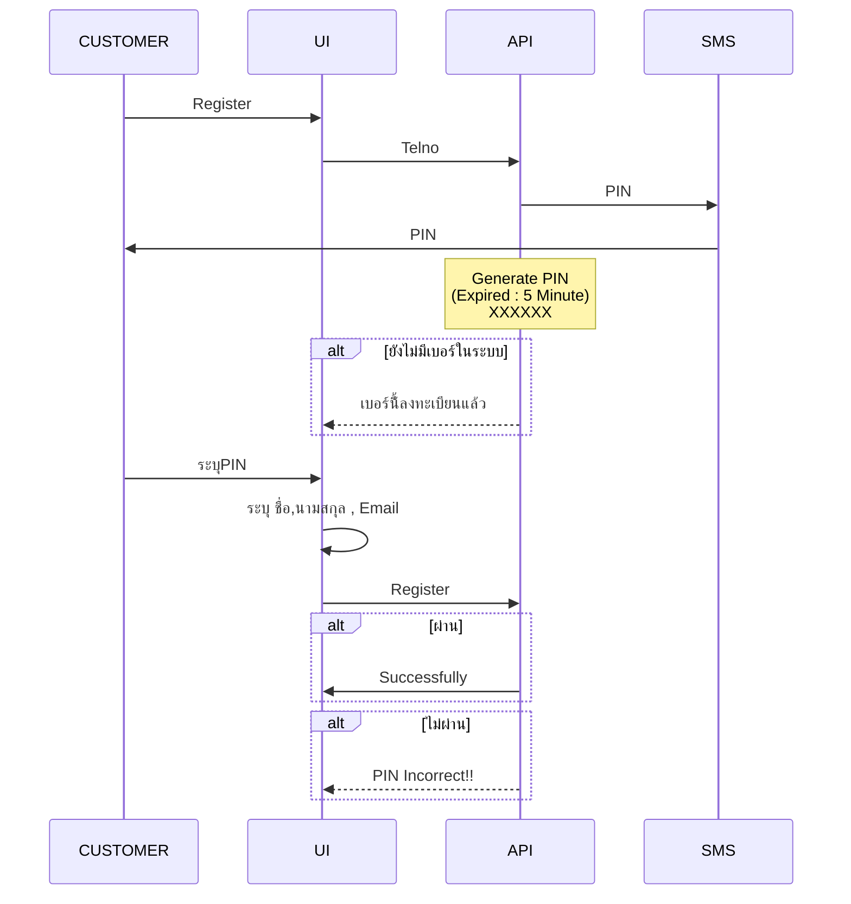

### Server https://perfectapi.extensionsoft.biz

## Authentication api 

### OTP Phone Request 

    Endpoint : "/auth/v1/otp/request"
    
    Content-Type : application/json 
  

request :
``` json 
     {  
        "code":"+66816554345"
     }
```
    code จะเป็นเบอร์โทรหรือ email ก็ได้

response 
``` json 
    {   
        "response":"success" ,
        "message" : "send otp to {phone}"
    }
``` 
## OTP To Email Request 
    Endpoint : "/auth/v1/otp/request"
    Content-Type : application/json 
    
``` json 

    {
    
         "code":"email@gmail.com"
        
    }
    
```
code จะเป็นเบอร์โทรหรือ email ก็ได้ 

response 
``` json 
    {   
        "response":"success" ,
        "message" : "send otp to {email}"
    }
``` 


### OTP validate


    Endpoint : "/auth/v1/otp/validate"
    
    Content-Type : application/json 


request :
``` json 
    {
        "code":"+66816554345",
        "pass_code":"xxxx"
    }
```
code จะเป็นเบอร์โทรหรือ email ก็ได้

response 
``` json 
    {   
        "response":"success" ,
        "message" : "-"
    }
``` 


### register 

   Endpoint : "/auth/v1/signup"
   
   Content-Type : application/json 
    
    
request :
``` json 
    {
        "code":"+66816554345",
        "ref_code:"231",
        "pass_code":"xxx",
        "password":"xxxxxx",
    }
```
code จะเป็นเบอร์โทรหรือ email ก็ได้

pass_code คือ รหัส otp ที่ส่งเข้าเบอร์

password รหัสผ่าน

ref_code รหัสผู้แนะนำ จะส่งไม่ส่งก็ได้

response  :
``` json 
    {
        "response": "success",
        "message": ""
    }
``` 


### login 
    Endpoint : "/auth/v1/signin"
    
    Content-Type : application/json 
    

request :
``` json 
    {
        "code":"+66816554345",
        "password":"xxxxxx"
    }
```
    code จะเป็นเบอร์โทรหรือ email ก็ได้
    password รหัสผ่าน

response 
``` json 
    {
        "response": "success",
        "message": "",
        "data": {
            "cod_ref": "4ldfjoiwqe12234",
            "token_1": "96f50588fd7a4f388a823169390e3c29",
            "token_2": "21lsdlkmvdlfklakdflkas"
        }
    }
``` 

### Reset Password

    Endpoint : "/auth/v1/reset/password"
    
    Content-Type : application/json 
    
    x-access-token : "{token}"

request :
``` json 
    {
        "code":"xxxxx",
        "new_password":"xxxxxxxx"
    }
```


response 
``` json 
    {   
        "response":"success" ,
        "message" : "-"
    }
``` 


## Flow Member Register

