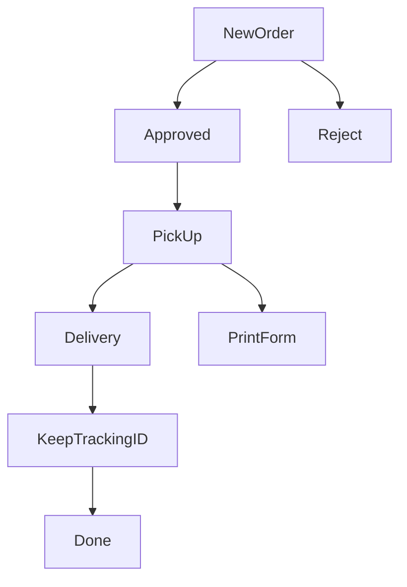

### ORDER Status WorkFlow 


​```mermaid

flow
st=>start: Start
op=>operation: Your Operation
cond=>condition: Yes or No?
e=>end

st->op->cond
cond(yes)->e
cond(no)->op
​```

### Server https://perfectapi.extensionsoft.biz

## Authentication api 

### Cart Add

    Endpoint : "/cart/add"
    Content-Type : application/json 

request :
``` json 
{
	"cart": [{
		"item_id": 1,
		"qty": 2
	},
	{
		"item_id": 1,
		"qty": 2
	}]
}
```
response 
``` json 
    {   
        "response":"success" ,
    }
``` 

## Cart Storage
    Endpoint : "/cart/storage"
    Content-Type : application/json 
    
``` json 
    {
         "id":"0613351889"
    }
```

response 
``` json 
{
    "response":"success" ,
    "data": [
        {
            "id": 1,
            "category_name": "category1",
            "image": "url"
        },
        {
            "id": 2,
            "category_name": "category2",
            "image": "url"
        },
        {
            "id": 3,
            "category_name": "category3",
            "image": "url"
        }
    ]
}
```